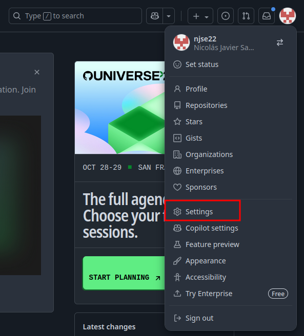
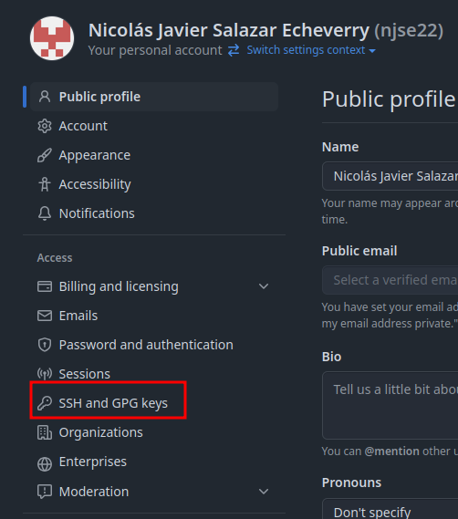
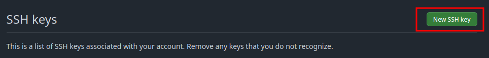
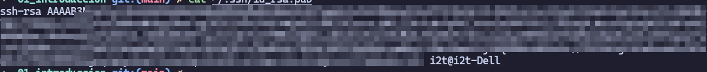
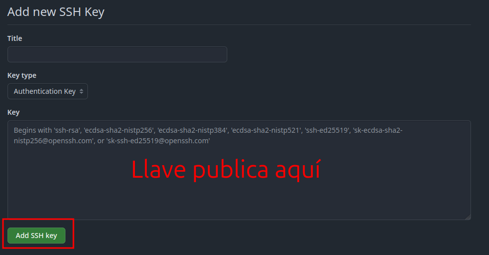

# Comandos

1. Para crear un repositorio desde 0: 

```bash
echo "# CONTENT" >> README.md
git init
git add README.md
git commit -m "first commit"
git branch -M main
git remote add origin <URL>
git push -u origin main
```

2. Para subir cambios por primera vez: 

```bash
git remote add origin <URL>
git branch -M main
git push -u origin main
```

3. Para clonar un repositorio:

```bash
git clone <URL>
```

4. Comandos basicos 

```bash
git add .                     # también git add --all 
git commit -m "COMENTARIO"    # Marcar el comentario 
git push                      # Subir los cambios 
git pull                      # Descargar cambios del repositorio 
git status                    # Validar el estado del repositorio 
```

5. Generación de las llaves `SSH`

```bash
ssh-keyagen -t rsa -b 4096 -C "CORREO@MAIL.COM"
eval "$(ssh-agent -s)"
ssh-add -k /path/to/ssh/private_key
cat /path/to/ssh_public_key.pub
```

6. Agregar llaves a la plataforma github 
   
   a. Ir a settings 

        

    b. Ir a `SSH and GPG keys`

        

    c. Agregar una nueva llave ssh 

        

    d. con el comando `cat` de los pasos anteriores leemos nuestra llave publica 

        

    e. agregamos la llave publica en la plataforma 

        


